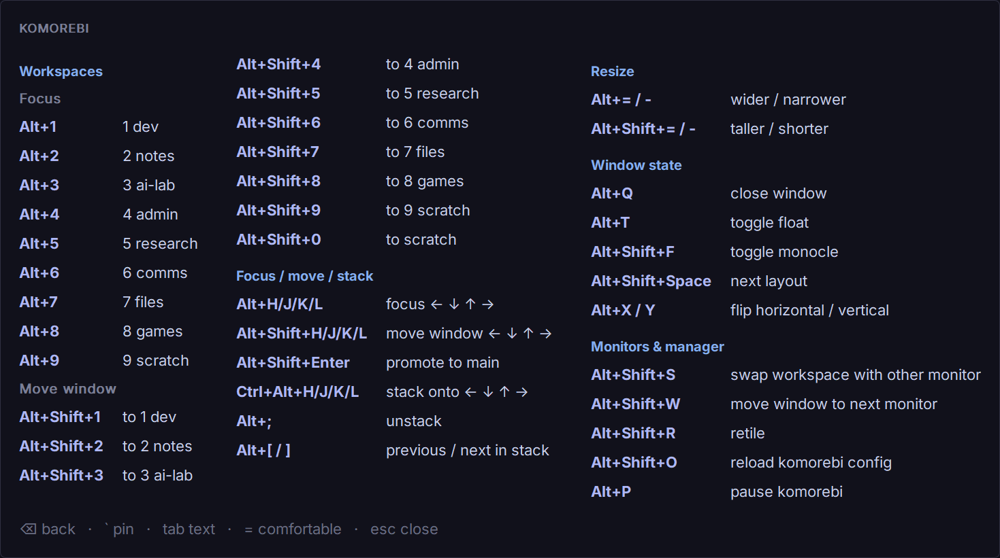
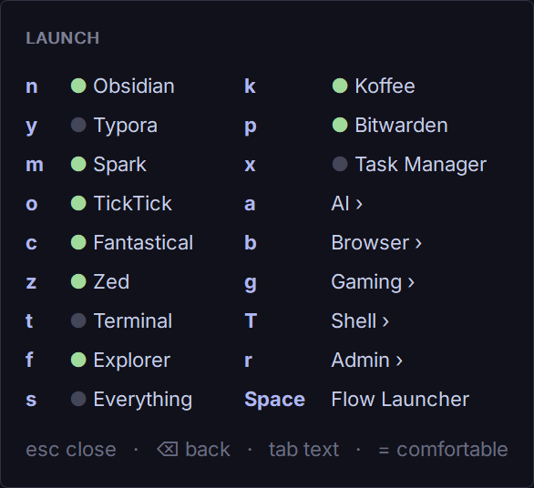
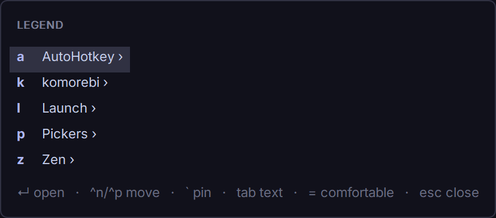
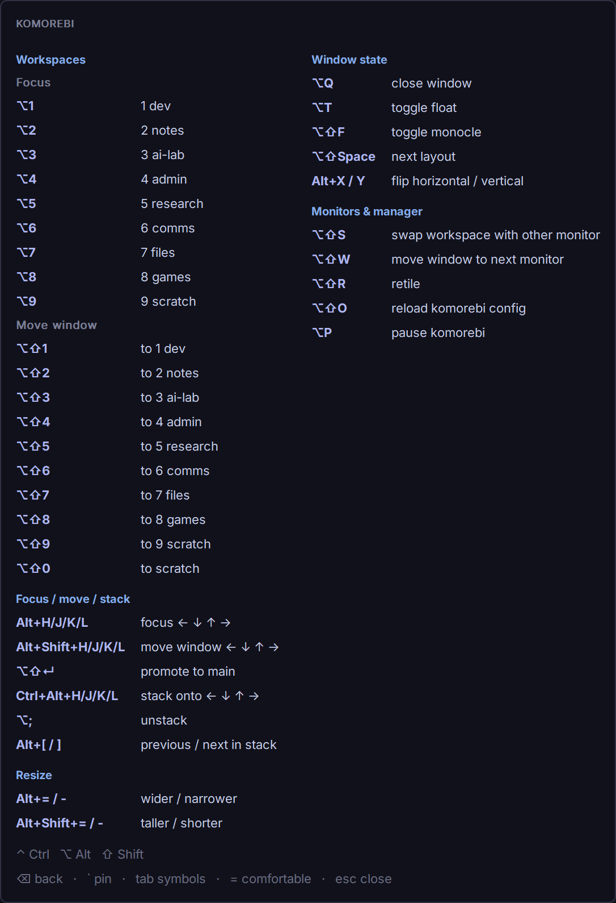

# Legend

A contextual shortcut overlay for AutoHotkey v2. Press one key to see the
shortcuts for the app you're in, or browse an index of every page. Your
AutoHotkey bindings and hand-written Markdown pages of an app's native
shortcuts are shown side by side; doc-only keys appear in a muted color.

<p align="center">
  
</p>

## Install

Copy or submodule this repo next to your script and include it:

```ahk
#Include Lib\Legend\Legend.ahk
```

## Bind keys

```ahk
komorebi := Legend.Page("komorebi")                       ; global page
komorebi.Category("Focus", [
    ["!h", "focus left", (*) => Run("komorebic focus left", , "Hide")],
    ["!l", "focus right", (*) => Run("komorebic focus right", , "Hide")]
])

zen := Legend.Page("Zen", "ahk_exe zen.exe")              ; only active in Zen
zen.Category("Tabs", [["#+o", "open tab in Chrome", OpenInChrome]])

Legend.Bind(["komorebi", "Workspaces"], "!1", "focus dev", FocusDev)   ; one line
Legend.Doc(["Zen", "Tabs"], "Ctrl+T", "new tab")                        ; doc only

Legend.Start({Pages: [A_ScriptDir "\legend\pages"]})
```

A row's optional 4th item `{Row: "Alt+H/J/K/L", Text: "focus ← ↓ ↑ →"}` merges
entries into one line.

Give a page its window `match` before binding keys on it: keys bound earlier were
registered everywhere, and Legend warns. Hotkeys go through `Legend.Binder`, a
function `(keyName, fn, match)` you can replace before binding (for example to
record bindings in tests).

## Chords

```ahk
Legend.Chord("#Space", "Launch", [
    Legend.Run("z", "Zed", (*) => Run("zed"), {Status: () => WinExist("ahk_exe Zed.exe")}),
    Legend.Menu("w", "Web", [Legend.Run("b", "Brave", (*) => Run("brave"))]),
    Legend.Run("s", "Sign-off", "Regards,{Enter}Me"),                 ; sent as keys
    Legend.Run("1-9", "Workspace", key => FocusWorkspace(key))         ; wildcard gets the key
])
```

Press the trigger, then keys. The menu appears after `ChordOverlay` ms (default
400; `"always"` / `"never"`); Esc or Ctrl+G cancels, Backspace goes up a level,
PgDn/PgUp or Ctrl+N/Ctrl+P page. Options per item: `If` (condition; the first
matching item whose `If` holds runs), `Status` (running dot), `Hint`. Keys may
use modifiers (`^s`; Shift+; is `+;`, not `:`) and [KeyChord](#acknowledgments) wildcards (`?`, `F*`,
`a-f`). `Start` options:
`ChordTimeout` (seconds, 0 = none), `ChordOverlay`, `ChordReference` (chords
appear as pages in Alt+/ unless `false`).

<p align="center">
  
</p>

## Pickers

```ahk
Legend.Picker("^!+p", "Colors", scope => ColorItems(scope), {
    OnPick: item => MsgBox(item.Text),
    Scopes: ["warm", "cool"]            ; optional; h/l switch, source gets the name
})
```

A picker opens a list: j/k, ↓/↑ or Ctrl+N/Ctrl+P move (the trigger again moves
down, Shift+trigger up), a letter or Enter picks, `/` filters (every word must
match), h/l change scope, `=` switches density, Esc cancels. Items are
`{Text, Detail?, Icon?, Letter?, Data?}`. Options: `OnPick` (required),
`OnHighlight`, `OnCancel`, `Start` (row selected at open), `Scopes`, `Scope`,
`Density`, `Match`, `Reference` (pickers are listed on a "Pickers" page in
Alt+/). Letters are assigned home row first and never use h/j/k/l or the
trigger's key.

## Window switcher

```ahk
Legend.WindowSwitcher("!a", {Scope: "all"})       ; every window, every virtual desktop
Legend.WindowSwitcher("!s", {Scope: "monitor"})   ; this desktop, this monitor
Legend.WindowSwitcher("!d", {Scope: "desktop", Scopes: ["desktop"]})   ; locked scope
```

A picker over your windows, most recent first with the previous one selected.
The highlighted window comes forward and gets an outline (theme color
`outline`); Esc puts everything back. Hooks for window managers: `Include`
(`hwnd => true` lets in a cloaked window), `Activate` (`hwnd => …` replaces the
default restore-and-activate) and `Detail` (`win => text`, the row's detail;
`win` has `Hwnd, Title, App, X, Y, W, H, Monitor, Minimized, Cloaked,
OnCurrentDesktop`).

## Page files

```markdown
---
match: ahk_exe zen.exe
key: z
---
# Zen

## Tabs
### Open & close
- `Ctrl+T` New tab
- `Ctrl+Shift+T` Reopen closed tab
```

`#` page, `##` category, `###` group, ``- `keys` description`` shortcut;
everything else is ignored. Write keys as `Ctrl+Shift+T`; ranges like
`Ctrl+1–8` are shown as written. A `match:` in a file decides which page opens
for the active window; only a match given in code makes hotkeys app-specific.

## Using the overlay

| Key | Effect |
|---|---|
| Alt+/ | open (the active app's page, or the index) / close |
| letter | open the lettered item |
| Backspace | back |
| Space / PgDn, PgUp | next / previous screen |
| `` ` `` | pin: stay open while you use shortcuts |
| Tab | show keys as text, symbols (`⌃⇧T`) or AHK (`^+t`) |
| `=` | switch between comfortable and compact spacing |
| Esc | close |
| any Ctrl/Alt/Win shortcut | closes the overlay and goes to the app |

<p align="center">
  
  &nbsp;
  
</p>

## Themes

`Legend.Start({Themes: [folder], Theme: "name"})` loads `name.ini` from your
folders or Legend's `themes/`; `"auto"` (default) follows Windows light/dark
with Catppuccin Latte/Mocha. Settings: `[colors]` background, border, title,
category, group, keyBound, keyDoc, description, footer, pinned, warning,
selection, selectionText, outline (pickers; default border, description, category);
`[fonts]` uiFont, keyFont, titleSize, headingSize, bodySize; `[layout]`
density (comfortable/compact), padding, rowSpacing, maxColumns,
maxHeightPercent, maxWidthPercent, opacity, rounded; `[keys]` keyStyle (text/symbols/ahk),
legend (auto/off/top/bottom). Leave padding and rowSpacing out to get them from
density. Tab and `=` change keyStyle and density until the script reloads.
Save theme files as ASCII or UTF-16.

## Development

`pwsh -File tests/Run-Tests.ps1` runs the unit tests and syntax checks.
`tests/race/ChordRace.ahk` (run by hand) checks that fast chord keys never strand
the overlay.
`examples/example.ahk` is a runnable demo.

## Acknowledgments

Chord mode is built on ideas from [KeyChord](https://github.com/tylerjcw/KeyChord)
by [tylerjcw](https://github.com/tylerjcw), which ran my own chord menus before
Legend had any. Nested chords, conditions where the first match wins, modifier
steps and the wildcard syntax all come from it, and the wildcards keep KeyChord's
syntax on purpose. Many thanks to tylerjcw for building KeyChord and sharing it:
it showed how good chords can feel in AutoHotkey.

## License

MIT
