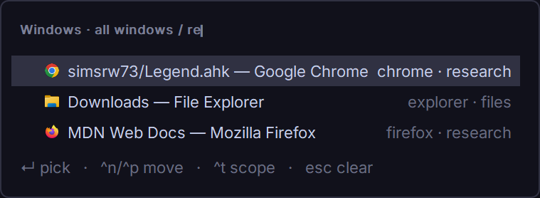
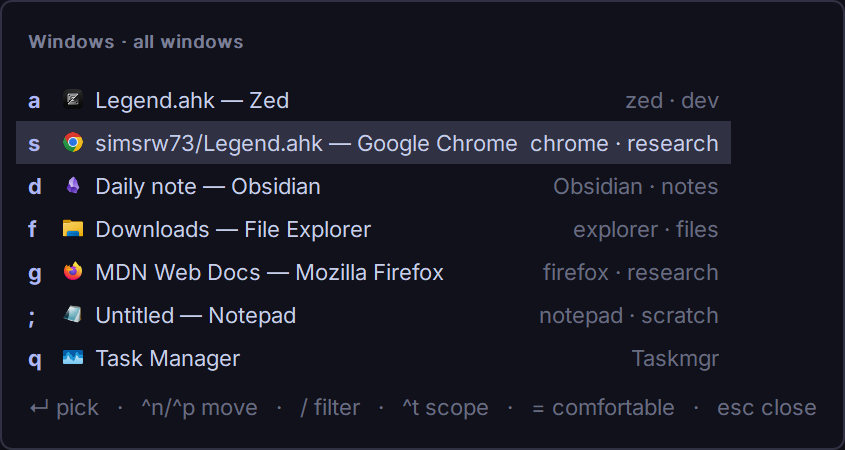

# Pickers and the window switcher

**Audience:** Legend users who want keyboard-driven lists: choose a file, a
snippet, a window.
**Topic:** `Legend.Picker`, the built-in window switcher, and directional window
focus.
**Goal:** add a list you open with a hotkey, filter by typing, and pick from
with one key.

## What a picker is

A *picker* is a list that opens on a hotkey. You move with the keyboard, filter
by typing, and pick an item, which runs your code with that item.

```ahk
#Requires AutoHotkey v2.0
#SingleInstance Force
#Include %A_ScriptDir%\Lib\Legend\Legend.ahk

Legend.Picker("^!o", "Open folder", (*) => [
    {Text: "Documents", Data: A_MyDocuments},
    {Text: "Desktop", Data: A_Desktop},
    {Text: "Temp", Data: A_Temp}
], {
    OnPick: item => Run(item.Data)
})

Legend.Start()
```

Press **Ctrl+Alt+O**, then **a** (each row has a letter) or move with
**Ctrl+N / Ctrl+P** and press **Enter**.

**What each part does:**

1. `"^!o"` is the hotkey that opens the picker.
2. `"Open folder"` is the title.
3. The third argument is the *source*: a function that returns the items. It runs
   each time the picker opens, so the list is always current.
4. Each item is an object. `Text` is shown; `Data` is yours, passed back when
   picked.
5. `OnPick` runs with the picked item, after the picker has closed.

## Keys in a picker

| Key | Effect |
|---|---|
| a letter | pick that row |
| Ctrl+N / Ctrl+P, ↓ / ↑ | move |
| Enter | pick the selected row |
| Ctrl+F / Ctrl+B, PgDn / PgUp | next / previous screen |
| `/` | filter: type words, every word must match; Esc clears |
| Ctrl+T | next scope (when the picker has scopes) |
| `=` | comfortable or compact spacing |
| Esc | cancel |

Letters are assigned home row first (`a s d f g ; q w e …`). They never use
h/j/k/l, which also move, or your trigger's key.

## Items

| Field | Type | Meaning |
|---|---|---|
| `Text` | text | the row's label (required) |
| `Detail` | text | a dimmer second column on the right |
| `Icon` | icon handle | a 16–20 px icon on the left (an `HICON`, e.g. from `LoadPicture`) |
| `Letter` | one character | a fixed letter for this row; others fill around it |
| `Data` | anything | your value, handed back in `OnPick` / `OnHighlight` |

## Scopes: one picker, several lists

Give `Scopes` a list of names; **Ctrl+T** cycles them and your source receives
the current one:

```ahk
#Requires AutoHotkey v2.0
#Include %A_ScriptDir%\Lib\Legend\Legend.ahk

Items(scope) {
    if scope = "Folders"
        return [{Text: "Documents", Detail: A_MyDocuments, Data: A_MyDocuments},
                {Text: "Desktop", Detail: A_Desktop, Data: A_Desktop}]
    return [{Text: "Notepad", Detail: "notepad.exe", Data: "notepad.exe"},
            {Text: "Calculator", Detail: "calc.exe", Data: "calc.exe"}]
}

Legend.Picker("^!o", "Open", Items, {
    Scopes: ["Folders", "Tools"],
    OnPick: item => Run(item.Data)
})

Legend.Start()
```

## Callbacks

| Option | Called with | When |
|---|---|---|
| `OnPick` (required) | the item | after a pick, once the picker has closed |
| `OnHighlight` | the item, or `""` | when the selection moves; `""` when a filter leaves nothing |
| `OnCancel` | nothing | after Esc or clicking away |

`OnHighlight` is for previews: the window switcher uses it to bring the
highlighted window forward.

## All picker options

| Option | Default | Meaning |
|---|---|---|
| `OnPick` | (required) | see above |
| `OnHighlight`, `OnCancel` | none | see above |
| `Scopes` | none | list of scope names |
| `Scope` | first scope | the scope to open with |
| `Start` | `1` | the row selected when it opens |
| `Density` | the theme's | `"comfortable"` or `"compact"` |
| `Match` | `""` | a WinTitle: the hotkey works only in matching windows |
| `Reference` | `true` | list the picker on the "Pickers" page in Alt+/ |
| `EmptyText` | `"Nothing to pick"` | shown when the source returns nothing |

<p align="center">
  
</p>

## The window switcher

`Legend.WindowSwitcher` is a ready-made picker over your open windows, a
keyboard-first Alt+Tab:

```ahk
#Requires AutoHotkey v2.0
#SingleInstance Force
#Include %A_ScriptDir%\Lib\Legend\Legend.ahk

Legend.WindowSwitcher("!a", {Scope: "all"})       ; every window, every virtual desktop
Legend.WindowSwitcher("!s", {Scope: "monitor"})   ; this desktop, this monitor

Legend.Start()
```

Windows are listed most recent first, with the previous window selected, so
**Alt+A, Enter** flips between your last two windows. The highlighted window
comes forward with an outline while you choose; **Esc** puts everything back.

| Option | Default | Meaning |
|---|---|---|
| `Scope` | `"all"` | `"all"`, `"desktop"` (this virtual desktop) or `"monitor"` |
| `Scopes` | all three | which scopes Ctrl+T cycles; one entry locks it |
| `Start` | `2` | row selected at open (2 = the previous window) |
| `Detail` | app name | `win => text`: the right-hand column |
| `Include` | none | `hwnd => true` lets in a hidden (cloaked) window |
| `Activate` | restore + activate | `hwnd => ...` replaces how a window is switched to |
| `Density`, `Match`, `Reference` | | as for pickers |

The `win` object passed to `Detail` has `Hwnd, Title, App, X, Y, W, H, Monitor,
Minimized, Cloaked, OnCurrentDesktop`.

### Recipe: show the process and monitor

```ahk
#Requires AutoHotkey v2.0
#Include %A_ScriptDir%\Lib\Legend\Legend.ahk

Legend.WindowSwitcher("!a", {
    Scope: "all",
    Detail: win => win.App " · monitor " win.Monitor (win.Minimized ? " · minimized" : "")
})

Legend.Start()
```

`Include` and `Activate` exist for tiling window managers such as komorebi, which
hide windows on other workspaces. The author's setup activates those windows
through komorebi so their workspace comes along.

<p align="center">
  
</p>

## Directional focus without a window manager

`LegendWindows.Focus(direction)` activates the nearest visible window to the
left, right, up or down, by window corners, and crosses to the next monitor at
the edge. Bound to Alt+H/J/K/L it gives tiling-style focus on plain Windows:

```ahk
#Requires AutoHotkey v2.0
#Include %A_ScriptDir%\Lib\Legend\Legend.ahk

focus := (dir) => (*) => LegendWindows.Focus(dir)

Legend.Page("Windows").Category("Focus", [
    ["!h", "focus left", focus("left"), {Row: "Alt+H/J/K/L", Text: "focus ← ↓ ↑ →"}],
    ["!j", "focus down", focus("down"), {Row: "Alt+H/J/K/L"}],
    ["!k", "focus up", focus("up"), {Row: "Alt+H/J/K/L"}],
    ["!l", "focus right", focus("right"), {Row: "Alt+H/J/K/L"}]
])

Legend.Start()
```
